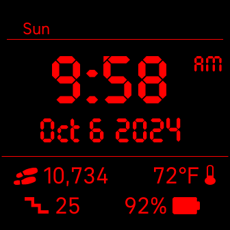

# Night Shift
 A Fitbit watch-face made to resemble the red-on-black displays of old fashion clock radios.

[Fitbit App Gallery listing](https://gallery.fitbit.com/details/2d897910-f126-416f-a833-78224e49b6ee?key=167d5091-b4ef-40d6-a34a-766913290e7d)

Troubleshooting: If the temperature does not show up: 
- Ensure that watch-face permissions are enabled. 
- Ensure that Fitbit app permissions on phone, including location services and background refresh, are enabled. 
- Try toggling on and off location services and background refresh permissions for Fitbit app on your phone. 
- Try reinstalling watch-face. 
- Try turning on and off on your phone. 
- Perform synching after above steps.

Troubleshooting: Switching between Celsius and Fahrenheit:
- Celsius currently only supported on Sense 2 and Versa 4 version. Sense and Versa 3 version pending approval by Fitbit.
- In Fitbit phone app, on "Today" screen, click on profile picture -> Fitbit settings -> Date, Time & units -> UNITS OF MEASUREMENT. An option to switch between Celsius and Fahrenheit is available across from Temperature. However, it may be necessary to toggle the Length value between "Feet, Miles" and "Centimeters, Kilometers" to actually toggle between Fahrenheit and Celsius in the Night Shift watch face. This seems to be an issue with the Fitbit software. 
